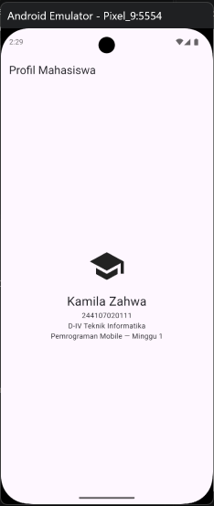

# Week 1 — Mobile Development Ecosystem & Flutter Refresh

Mini assignment Minggu 1: memahami ekosistem pengembangan mobile, me-refresh dasar Dart/Flutter, menyiapkan environment, dan membangun aplikasi Profil Mahasiswa sederhana.

## 1. Tujuan

Setelah menyelesaikan codelab ini, mahasiswa mampu:

- Menjelaskan evolusi pengembangan mobile serta perbedaan **native** (Kotlin/Swift), **hybrid** (Ionic/Cordova), dan **cross-platform** (Flutter/React Native) beserta trade-off-nya.
- Menjelaskan arsitektur Flutter (framework → engine → embedder), peran Dart (JIT saat develop, AOT saat rilis), struktur proyek, dan konsep widget tree.
- Mengulang dasar Dart: variabel, tipe data, fungsi, class, dan **null safety** (`?`, `?.`, `??`, menghindari `!` yang tidak terbukti aman).
- Menyiapkan Flutter SDK + Android SDK + emulator/perangkat fisik sampai `flutter doctor` bersih dan `flutter devices` mendeteksi target.
- Mengubah UI default Flutter menjadi halaman profil, memahami **hot reload** (state dipertahankan) vs **hot restart** (state diulang dari awal), lalu mem-push hasilnya ke repository Git pribadi.

## 2. Fitur Utama

Aplikasi Profil Mahasiswa (`lib/main.dart`):

- `MaterialApp` tanpa banner debug sebagai root widget.
- `Scaffold` + `AppBar` bertajuk "Profil Mahasiswa".
- Body `Center` → `Column` berisi:
  - `Icon(Icons.school, size: 72)` sebagai identitas visual,
  - `Text('Kamila Zahwa', fontSize: 24)` — nama mahasiswa,
  - `Text('Pemrograman Mobile — Minggu 1')` — konteks tugas.
- UI deklaratif murni `StatelessWidget`; perubahan teks/ikon langsung terlihat via hot reload.

Widget tree: `MyApp` → `MaterialApp` → `Scaffold` → `Center` → `Column` → `Icon` / `SizedBox` / `Text`.

## 3. Stack Teknologi

| Komponen | Detail |
|---|---|
| Framework | Flutter (Material) |
| Bahasa | Dart `^3.13.2`, null safety aktif |
| Dependency | `cupertino_icons ^1.0.8` (pubspec), `flutter_lints ^6.0.0` (dev) |
| IDE | VS Code + ekstensi Flutter/Dart |
| Platform target | Android (emulator / perangkat fisik via USB debugging) |
| Version control | Git + GitHub |
| Verifikasi | `flutter doctor`, `flutter devices` |

Struktur proyek standar Flutter: `lib/` (entry `main.dart`), `test/` (widget test bawaan), `android/`/`ios/`/`web/` (konfigurasi platform), `pubspec.yaml` (metadata & dependensi), `screenshots/` (bukti visual).

## 4. Cara Menjalankan

### Prasyarat

- Git, VS Code (ekstensi Flutter + Dart), Flutter SDK (`flutter/bin` masuk `PATH`), Android Studio + Android SDK / Command-line Tools + emulator.
- Emulator aktif (Device Manager) atau HP Android dengan Developer Options + USB debugging menyala dan sudah di-otorisasi.

### Verifikasi environment

```bash
flutter --version
flutter doctor
flutter doctor --android-licenses
flutter devices   # minimal 1 target muncul
```

### Jalankan aplikasi

```bash
flutter pub get
flutter run        # pilih emulator / perangkat bila diminta
```

Di terminal `flutter run`: tekan `r` = hot reload, `R` = hot restart.

## 5. Hasil yang Dicapai

- [x] `flutter doctor` lolos tanpa masalah penghambat Android.

  

- [x] `flutter devices` berhasil mendeteksi emulator.

  

- [x] UI default diganti halaman Profil Mahasiswa dan tampil benar di emulator.

  
- [x] Praktik hot reload vs hot restart untuk perubahan teks/ikon terkonfirmasi.
- [x] Memahami perbedaan hot reload (state dipertahankan, untuk iterasi UI) vs hot restart (aplikasi diulang dari awal, untuk perubahan inisialisasi).

- [x] Setup VS Code (ekstensi Flutter), unduhan Android SDK/CLI, dan commit awal Git (`git add` + `git commit`) terdokumentasi di `screenshots/`.


### Kendala setup & solusi singkat

- Unduhan Flutter SDK/Android CLI lama → biarkan proses selesai, jangan batalkan; buka terminal baru untuk `flutter doctor` berikutnya.
- Perangkat fisik tidak terdeteksi → cek kabel data (bukan kabel charge saja), driver USB, USB debugging aktif, dan dialog otorisasi di HP.
- Lisensi Android belum diterima → jalankan `flutter doctor --android-licenses` lalu `flutter doctor` ulang.

### Hasil Mini Assignment

> Berhasil menambahkan NIM dan informasi tambahan lainnya


### Refleksi
1. Kapan native lebih tepat dipilih daripada cross-platform?
> Native lebih tepat saat butuh performa tinggi (game 3D, AR/VR), akses penuh ke fitur platform, atau target pengguna cuma satu platform. Kalau fitur cross-platform sudah cukup, cross-platform lebih efisien karena satu kode basis untuk iOS dan Android.

2. Bagaimana perubahan state berhubungan dengan widget tree dan UI deklaratif?
> Dalam UI deklaratif, kita cukup nyatakan "UI harus seperti ini saat state begini." Saat state berubah, Flutter hanya me-*rebuild* bagian widget tree yang terdampak, jadi UI langsung mencerminkan state baru tanpa perlu manipulasi manual.

3. Mengapa commit kecil dengan pesan jelas bermanfaat bagi pekerjaan tim dan portfolio?
> Commit kecil mudah di-*review* dan dilacak jika ada bug. Pesan yang jelas memudahkan tim memahami perubahan tanpa membuka file diff. Untuk portfolio, riwayat commit yang rapi menunjukkan kedisiplinan kerja yang profesional.
