# Week 2 — Declarative UI & Responsive Design

Mini assignment Minggu 2: memahami prinsip declarative UI, membangun layout responsif dengan widget dasar Flutter, menerapkan dark/light theme, serta menambahkan label aksesibilitas untuk screen reader.

## 1. Tujuan

Setelah menyelesaikan codelab ini, mahasiswa mampu:

- Menjelaskan prinsip **declarative UI** dan hubungan antara widget, konfigurasi, serta state.
- Menggunakan `StatelessWidget`, `StatefulWidget`, `Container`, `Row`, `Column`, dan `Expanded`.
- Membedakan komponen **Material 3** dan **Cupertino** untuk kebutuhan platform yang berbeda.
- Membangun **layout responsif** untuk ukuran layar mobile dan tablet.
- Menerapkan **theme**, **dark mode**, **styling**, dan **aksesibilitas dasar** (`Semantics`).

## 2. Fitur Utama

Aplikasi Academic Overview (`lib/main.dart`):

### Praktikum — Student Dashboard

- `StatefulWidget` sebagai root (`DashboardApp`) untuk mengelola state `isDark`.
- `MaterialApp` dengan `theme` / `darkTheme` berbasis `ThemeData(useMaterial3: true)`.
- Toggle tema menggunakan `Switch.adaptive` di `AppBar` actions.
- Body `LayoutBuilder` mendeteksi lebar layar → `GridView.count` dengan `crossAxisCount` dinamis:
  - **Layar sempit** (< 600 px) → 1 kolom.
  - **Layar lebar** (≥ 600 px) → 2 kolom.
- Empat `DashboardCard` berisi: Assignments, Attendance, Portfolio, Current Week.
- Setiap kartu menggunakan `Card` → `Padding` → `Row` dengan `Expanded` untuk teks + nilai.

### Tugas — Academic Overview

- Profil header (`_ProfileHeader`): `Container` dengan gradient, `CircleAvatar` inisial, nama, NIM, dan badge semester.
- Empat kartu informasi (`InfoCard`): GPA, Attendance, Assignments, Current Week — masing-masing dengan ikon berwarna dan subtitle.
- Quick Summary Row: `Container` dengan `Row` → `Icon` + `Expanded(Column)` menampilkan ringkasan mata kuliah.
- Layout responsif via `LayoutBuilder` → `SliverGrid` dengan `SliverGridDelegateWithFixedCrossAxisCount`:
  - **Mobile** → 1 kolom, `childAspectRatio: 2.8`.
  - **Tablet** → 2 kolom, `childAspectRatio: 2.4`.
- Seluruh elemen penting dibungkus `Semantics` dengan label deskriptif untuk screen reader.


## 3. Stack Teknologi

| Komponen | Detail |
|---|---|
| Framework | Flutter (Material 3 + Cupertino icons) |
| Bahasa | Dart `^3.13.2`, null safety aktif |
| Dependency | `cupertino_icons ^1.0.8` (pubspec), `flutter_lints ^6.0.0` (dev) |
| Widget kunci | `LayoutBuilder`, `GridView.count`, `Row`, `Column`, `Expanded`, `Container`, `Switch.adaptive`, `Semantics` |
| IDE | VS Code + ekstensi Flutter/Dart |
| Platform target | Android (emulator / perangkat fisik) |
| Version control | Git + GitHub |

## 4. Cara Menjalankan

### Prasyarat

- Flutter SDK (`flutter/bin` masuk `PATH`), Android Studio + Android SDK / emulator.

### Verifikasi environment

```bash
flutter --version
flutter doctor
flutter devices   # minimal 1 target muncul
```

### Jalankan aplikasi

```bash
cd 02-week-2-declarative-ui-responsive-design
flutter pub get
flutter run        # pilih emulator / perangkat bila diminta
```

Di terminal `flutter run`: tekan `r` = hot reload, `R` = hot restart.

## 5. Hasil yang Dicapai
- [x] Membuat kartu profil sederhana
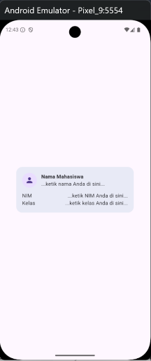

- [x] Eksperimen menghapus `Expanded` pada baris nama
> Sebelum: 

> Sesudah: 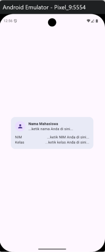

- [x] Eksperimen Mengganti `mainAxisSize: MainAxisSize.min` menjadi nilai default

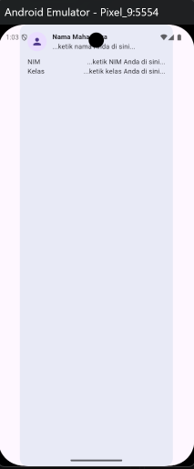

- [x] Eksperimen menambahkan satu baris data menggunakan pola `Row` + `Expanded` yang sama

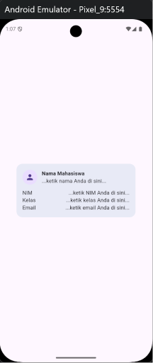

### Praktikum — Dashboard Responsif
- [x] Membuat aplikasi profil sederhana

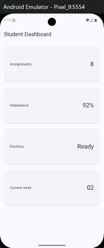

- [x] Menambahkan interaksi dengan StatefulWidget dan Cupertino

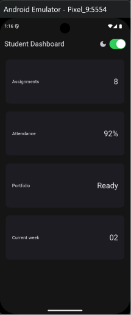

- [x] Perbedaan tampilan CupertinoSwitch dan Switch.adaptive
> CupertinoSwitch 

> Switch.adaptive 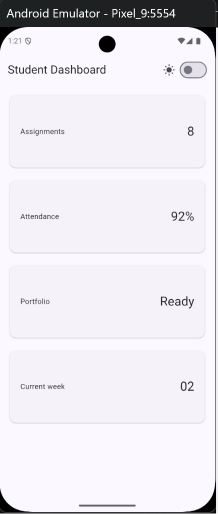

- [x] Eksperimen mengubah breakpoint dari 700 menjadi 200

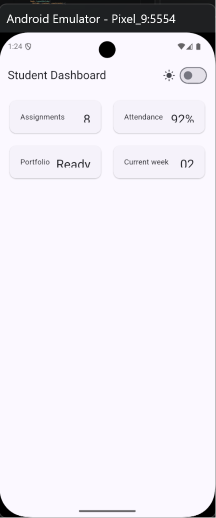

- [x] Eksperimen mengubah `themeMode`

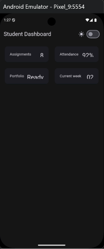
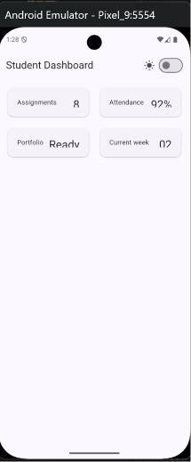

- [x] Menguji dengan ukuran layar emulator yang berbeda

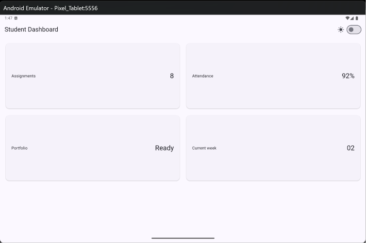

- [x] Eksperimen menambahkan `Semantics` atau label untuk screen reader

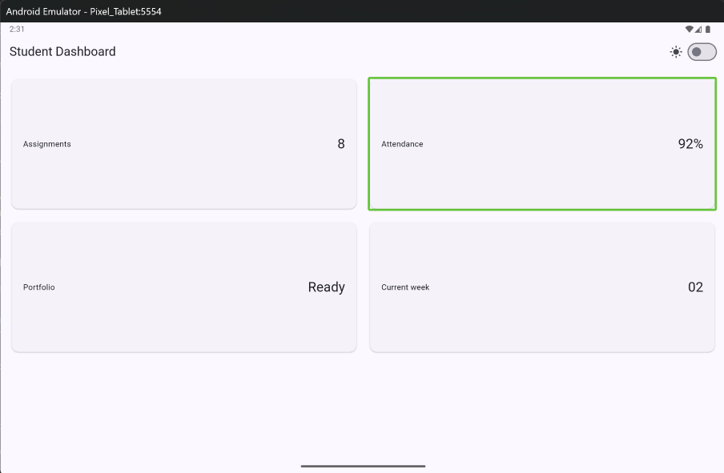


### Tugas — Academic Overview (Final)

- [x] Header profil dengan avatar, nama, NIM, dan badge semester.
- [x] Empat kartu informasi (GPA, Attendance, Assignments, Current Week) dengan ikon berwarna dan subtitle.
- [x] Layout responsif: 1 kolom (phone) dan 2 kolom (tablet).
- [x] Toggle tema light/dark menggunakan `CupertinoSwitch`.
- [x] Label aksesibilitas (`Semantics`) pada profil, setiap kartu, toggle tema, dan quick summary.

  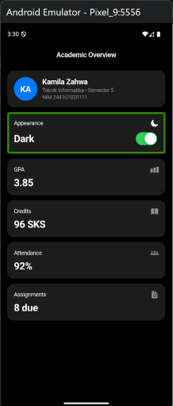
  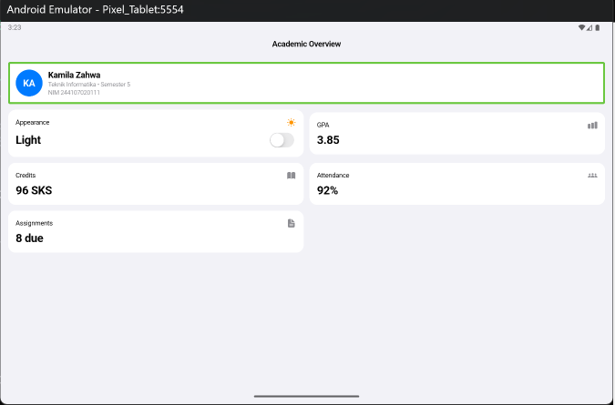

### AI Prompt Challenge

Setelah implementasi mandiri selesai, tiga prompt dikirimkan ke AI untuk membandingkan alternatif desain dan memverifikasi hasil:

#### 1. Prompt Perbandingan Tata Letak

> *"Bandingkan dua tata letak dashboard akademik untuk Flutter: versi `GridView` dan versi `LayoutBuilder` + `Column`. Jelaskan trade-off responsif dan aksesibilitasnya."*

**Output:** Menggunakan `LayoutBuilder` + `SliverGrid` (bukan `GridView.count`) karena memberikan kontrol lebih halus terhadap `SliverGridDelegateWithFixedCrossAxisCount` — `childAspectRatio` bisa diatur berbeda untuk mobile (2.8) dan tablet (2.4), sehingga proporsi kartu tetap nyaman dibaca di kedua ukuran layar. `GridView.count` lebih ringkas tetapi kurang fleksibel untuk variasi aspect ratio per breakpoint.

#### 2. Prompt Penguatan Konsep

> *"Jelaskan kapan penggunaan `Expanded` justru menyebabkan overflow di dalam `Row`, beri contoh kode yang gagal dan perbaikannya."*

**Output:** `Expanded` menyebabkan overflow saat digunakan pada konten dengan lebar minimum yang melebihi sisa ruang `Row` — misal teks panjang tanpa `overflow: TextOverflow.ellipsis`. Pada proyek ini, setiap `Row` menggunakan `Expanded` hanya untuk satu elemen teks (sisi lain berisi ikon atau badge dengan lebar tetap), sehingga risiko overflow terminimalkan. Untuk keamanan tambahan, teks panjang pada kartu dibatasi dengan `maxLines` dan `ellipsis`.

#### 3. Verification Prompt

> *"Periksa kembali rekomendasi layout di atas: apakah tetap responsif di bawah 600px, apakah mengurangi aksesibilitas, dan apakah ada widget yang tidak tersedia di Flutter stabil saat ini?"*

**Hasil verifikasi:** Seluruh widget yang digunakan (`LayoutBuilder`, `SliverGrid`, `SliverAppBar`, `Semantics`, `Switch.adaptive`, `CupertinoIcons`) tersedia di Flutter stabil. Breakpoint 600px bekerja dengan benar — di bawah 600px layout menampilkan 1 kolom, di atas menampilkan 2 kolom. Tidak ada penurunan aksesibilitas karena `Semantics` labels tetap aktif di kedua mode layout.

#### Dokumentasi Keputusan

| Aspek | Keputusan | Alasan |
|---|---|---|
| Layout engine | `LayoutBuilder` + `SliverGrid` | Aspect ratio dinamis per breakpoint |
| Toggle tema | `Switch.adaptive` | Tampil native di Material & Cupertino |
| Proyek akhir | Material 3 (`ThemeData`) | Konsisten dengan praktikum & lebih banyak widget |
| Breakpoint | 600 px | Batas umum phone vs tablet Flutter |
| Aksesibilitas | `Semantics` pada semua elemen informatif & interaktif | Wajib untuk screen reader |

### Refactoring Challenge
Memastikan hasil refactoring yang telah dilakukan tidak ada error menggunakan `flutter analyze`
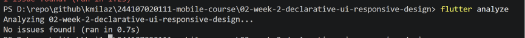

### Testing
Memverifikasi perilaku responsif menggunakan `flutter test`
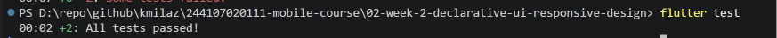


## 6. Refleksi

### Apa perbedaan utama antara pendekatan declarative dan imperative dalam membangun UI?

> Dalam pendekatan **imperative**, developer secara eksplisit memanipulasi objek UI (misal: `view.setText("...")`). Dalam **declarative** (Flutter), kita cukup mendeskripsikan UI harus seperti ini untuk state tertentu, dan framework yang menangani rebuild secara otomatis. Ini membuat kode lebih singkat, lebih mudah di-predict, dan minim bug terkait sinkronisasi state.

### Bagaimana LayoutBuilder membantu dalam membuat UI yang responsif?

> `LayoutBuilder` memberikan `BoxConstraints` ke builder function, sehingga kita bisa mengetahui lebar/tinggi layar secara real-time dan mengambil keputusan desain secara dinamis — misal: 1 kolom di phone, 2 kolom di tablet — tanpa hardcode breakpoint. Ini sangat berganti ketika tidak ingin bergantung pada `MediaQuery` yang mengembalikan ukuran seluruh layar.

### Mengapa pemilihan widget (StatelessWidget vs StatefulWidget) menjadi pertimbangan penting?

> `StatefulWidget` diperlukan saat ada state yang berubah dari waktu ke waktu (misal: nilai toggle tema). `StatelessWidget` cukup untuk komponen yang murni menerima data dari parent dan menampilkannya tanpa mengelola state sendiri. Pemilihan yang tepat menjaga widget tree tetap efisien — state hanya disimpan di widget yang benar-benar membutuhkannya, sehingga rebuild lebih terarah dan performa lebih baik.

### Bagaimana tema dan dark mode meningkatkan pengalaman pengguna secara keseluruhan?

> Dark mode mengurangi kelelahan mata di lingkungan gelap dan menghemat baterai pada layar OLED. Dengan `ThemeData` dan `Switch.adaptive`, transisi antar tema terasa mulus dan konsisten di seluruh komponen. Pengguna merasa lebih nyaman karena aplikasi menyesuaikan dengan preferensi sistem atau preferensi manual mereka.

### Apa tantangan dalam menerapkan aksesibilitas pada aplikasi Flutter?

> Tantangan utamanya adalah memastikan **setiap** elemen interaktif dan informatif memiliki label `Semantics` yang deskriptif. Tanpa label, screen reader hanya membaca teks mentah yang mungkin tidak bermakna dalam konteks. Selain itu, pengujian aksesibilitas perlu dilakukan di perangkat nyata dengan TalkBack/VoiceOver aktif, karena simulasi di emulator tidak selalu merepresentasikan pengalaman pengguna tunanetra secara akurat.

### Bagaimana penggunaan Row, Column, dan Expanded membantu dalam menyusun layout yang fleksibel?

> Kombinasi `Row` (horizontal), `Column` (vertical), dan `Expanded` (mengambil sisa ruang yang tersedia) memungkinkan pembangunan layout yang proporsional tanpa hardcode ukuran pixel. `Expanded` memastikan anak widget mengisi ruang kosong secara merata, sehingga layout tetap proporsional di berbagai ukuran layar. Ini adalah fondasi dari layout responsif di Flutter.

