# Minggu 3 — Navigation & State Management

### Tujuan

Mini project ini dibuat untuk menguasai konsep navigasi dan state management dalam Flutter. Secara spesifik, project ini bertujuan untuk memahami perbedaan Navigator 1.0 dengan GoRouter, menerapkan navigasi multi-page menggunakan GoRouter, serta mempelajari cara mengelola state secara terpusat menggunakan Riverpod (Provider, ConsumerWidget, Notifier). Selain itu, project ini juga mencakup penggunaan AsyncValue untuk menangani state asinkron (loading, error, success) pada UI.

---

### Fitur Utama

Aplikasi ini adalah aplikasi daftar tugas (ToDo) sederhana yang berisi CRUD (Create, Read, Update, Delete) dari objek Todo. Fitur yang dikembangkan meliputi:

- Daftar tugas dengan operasi tambah, centang selesai, dan hapus
- Halaman statistik yang menampilkan total tugas, tugas selesai, dan tugas yang belum selesai
- Navigasi antar halaman menggunakan bottom navigation bar
- Penanganan state asinkron (loading, error, success) pada halaman statistik

---

### Stack Teknologi

- Flutter SDK 3.13.2
- Riverpod 3.4.3 (state management)
- GoRouter 18.0.1 (deklaratif routing)
- flutter_test (widget testing)

---

### Cara Menjalankan

Setelah clone repository ini, pastikan Flutter SDK sudah terinstall di mesin kamu. Kemudian jalankan perintah berikut di terminal:

```bash
cd 03-week-3-navigation-state-management
flutter pub get
flutter run
```

Untuk menjalankan test:

```bash
flutter analyze
flutter test
```

---

### Hasil yang Dicapai

#### Praktikum 1 — Navigasi Multi-page dengan GoRouter

Membuat aplikasi Flutter dengan dua halaman (HomePage dan DetailPage) yang dihubungkan oleh GoRouter. Halaman HomePage menampilkan daftar item, dan ketika salah satu item ditekan akan berpindah ke DetailPage dengan path parameter. File yang terlibat: `home_page.dart`, `detail_page.dart`, `main.dart`.

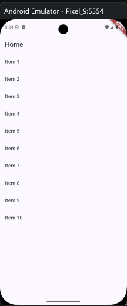
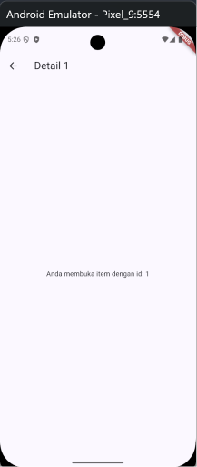

#### Praktikum 2 — Aplikasi ToDo dengan Riverpod

Membuat aplikasi ToDo dengan state management menggunakan Riverpod. Model Todo dibuat immutable menggunakan `copyWith()`, dan state dikelola oleh `TodoListNotifier` yang merupakan `Notifier<List<Todo>>`. UI menggunakan `ConsumerWidget` dengan `ref.watch` di dalam `build()` dan `ref.read` di dalam callback. File yang terlibat: `todo_provider.dart`, `todo_page.dart`.

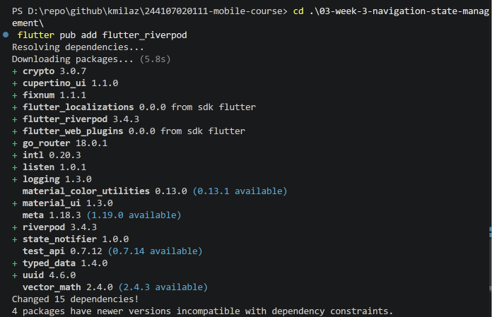
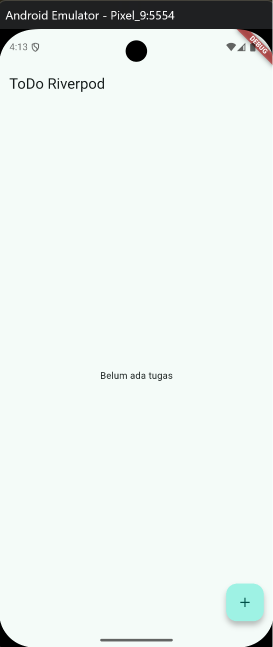
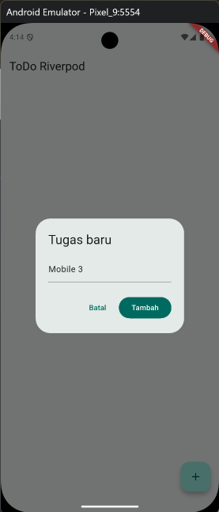
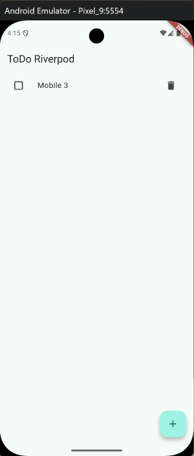

#### Praktikum 3 — AsyncValue: Loading, Error, Success

Membuat halaman statistik menggunakan `AsyncNotifier` yang mensimulasikan pengambilan data dari server dengan delay 2 detik. UI menggunakan `AsyncValue.when()` untuk menangani tiga kondisi: loading (spinner), error (pesan kesalahan + tombol retry), dan success (menampilkan data statistik). File yang terlibat: `stats_provider.dart`, `stats_page.dart`.

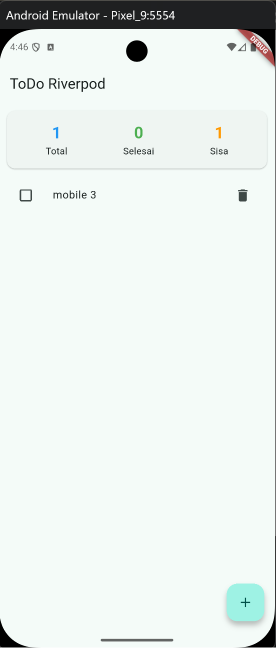
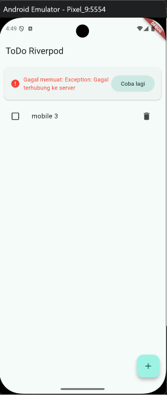
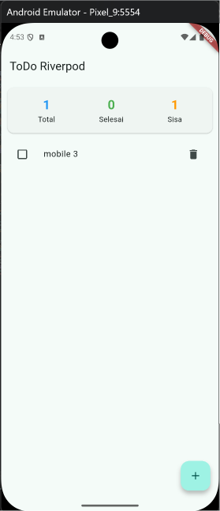

#### AI Challenge

Membuat halaman StatsPage dengan bantuan AI (GitHub Copilot). Hasil AI diverifikasi terhadap beberapa kriteria: penggunaan pattern immutable, pemisahan `ref.watch` di `build()` dan `ref.read` di callback, penanganan ketiga state AsyncValue, deklarasi provider dengan tipe eksplisit, serta penggunaan API Riverpod versi terkini (bukan `StateProvider` atau `StateNotifierProvider`). Beberapa perbaikan dilakukan, di antaranya penggantian `ref.read` menjadi `ref.watch` di dalam `build()` StatsNotifier agar statistik otomatis update saat todo berubah, serta penggantian `withOpacity()` menjadi `withValues(alpha:)` karena deprecated.

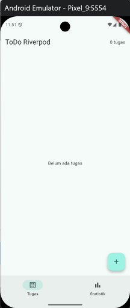
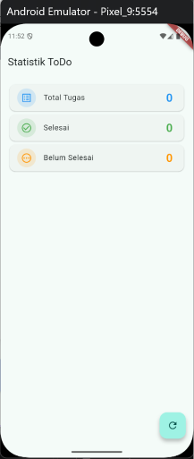

#### Refactoring & Testing

Melakukan tiga refactoring utama: ekstrak widget `TodoTile` agar kode lebih terbaca, membuat `filteredTodoProvider` sebagai provider turunan untuk memfilter todo yang belum selesai, serta mengintegrasikan GoRouter dengan `ShellRoute` agar bottom navigation bar tetap tampil di semua halaman. Widget test dibuat untuk memverifikasi fitur menambah tugas baru, dan seluruhnya lulus saat dijalankan.


#### Mini Project

Menggabungkan seluruh hasil praktikum menjadi aplikasi ToDo yang utuh dengan dua halaman (daftar tugas dan statistik), navigasi using GoRouter dengan `ShellRoute`, state management menggunakan Riverpod, serta penanganan state asinkron menggunakan AsyncValue. Aplikasi telah diverifikasi dengan `flutter analyze` (0 issues) dan `flutter test` (1 test passed).

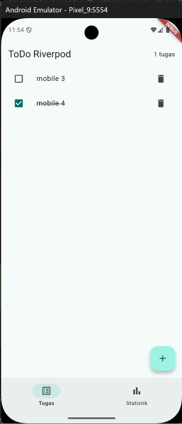
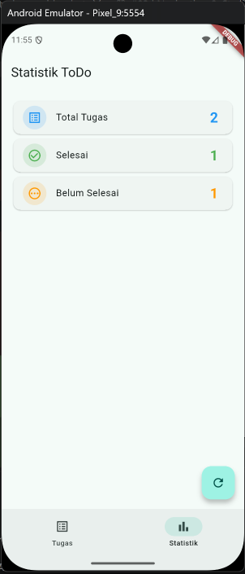

#### Refleksi

1. Kapan `setState` masih cukup, dan kapan state harus naik ke Riverpod?
> `setState` cukup ketika state hanya digunakan  oleh satu widget dan tidak dibagikan ke halaman lain. Contohya toggle show/hide password di TextField. Sedangkan Riverpod digunakan ketika state harus dibagikan ke banyak halaman/widget (misalnya daftar todo tampil di TodoPage dan dihitung di StatsPage) dan state perlu bertahan meskipun widget sudah tidak tampil (contoh: user pindah halaman lalu balik, data tetap ada).  Di project ini, `setState` tidak cukup karena daftar todo harus diakses oleh TodoPage (untuk menampilkan/menghapus) dan sekaligus oleh StatsPage (untuk menghitung total). Jadi state dikelola oleh Riverpod di TodoListNotifier.


2. Apa perbedaan `context.go` dan `context.push`, dan kapan masing-masing tepat digunakan?
> `context.go` digunakan untuk mengganti seluruh stack navigasi. Route sebelumnya dihapus dari stack. Cocok digunakan saat navigasi via bottom navigation bar, redirect login, halaman utama. Contohnya, user tekan "Statistik" di bottom nav → stack hanya berisi StatsPage, tidak ada "back" ke TodoPage lewat tombol panah

> `context.push` digunakan untuk menambah route baru di atas stack. Route sebelumnya tetap ada di bawah. Cocok digunakan saat membuka halaman detail, form tambah data, halaman yang butuh tombol "back". Contohnya user tekan item todo → DetailPage ditumpuk di atas TodoPage, tombol back bisa kembali ke TodoPage

> Di project ini, bottom nav pakai `context.go` karena user berpindah antar halaman utama (bukan drill-down). Kalau suatu saat ada halaman detail, bisa pakai `context.push`.

3. Bagaimana AsyncValue mencegah bug dibanding tiga boolean terpisah?
> Kalau pakai tiga boolean terpisah:
```dart
bool isLoading = false;
bool hasError = false;
bool hasData = false;
```
> Ketiga boolean ini bisa tidak konsisten. Misal isLoading = true dan hasData = true secara bersamaan (tidak masuk akal tapi bisa terjadi). Selain itu, developer harus manual update ketiga boolean di setiap kondisi, rentan lupa. UI harus mengecek berbagai kombinasi boolean, kode jadi rumit. 

>AsyncValue mencegah ini karena hanya satu kondisi aktif pada satu waktu. Saat data sudah masuk via AsyncData(), maka AsyncLoading() sudah tidak ada lagi: 
```dart
statsAsync.when(
  loading: () => ...,  // hanya dipanggil saat loading
  error: (err, _) => ..., // hanya dipanggil saat error
  data: (stats) => ...,   // hanya dipanggil saat data siap
)
```
4. Bagian mana dari hasil AI yang Anda perbaiki, dan mengapa?
> Pertama: `ref.read` → `ref.watch` di `StatsNotifier.build()`. Di mana Kode AI awalnya pakai ref.read(todoListProvider) di dalam build(). Ini menyebabkan statistik tidak pernah update karena ref.read hanya membaca sekali saat pertama kali build. Setelah user menambah/menghapus todo, stats tetap menampilkan angka lama. Diganti ke ref.watch agar StatsNotifier otomatis rebuild saat todoListProvider berubah.

> Kedua: `withOpacity()` → `withValues`(alpha:) di `StatsPage`. `withOpacity()` sudah deprecated di Flutter versi terkini karena masalah presisi warna. Diganti ke withValues(alpha:) agar tidak muncul warning di flutter analyze.

>Keduanya diperbaiki bukan karena kode AI "salah" secara logika, tapi karena tidak sesuai dengan behavior yang diharapkan (yang pertama) dan standar API terkini (yang kedua).
