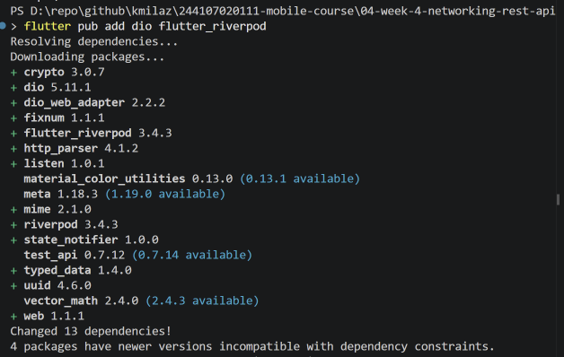
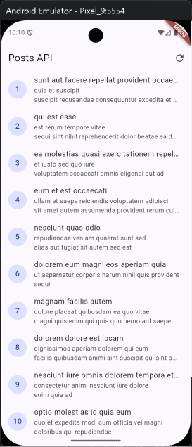
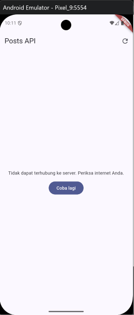
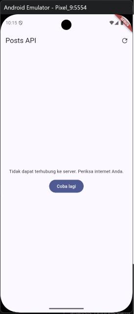
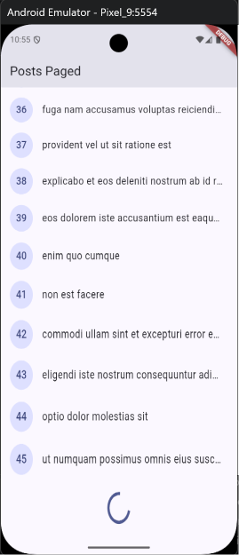
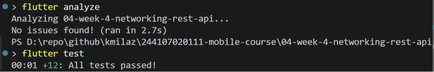

# Minggu 4 — Networking & REST API

### Tujuan

Mini project ini dibuat untuk memahami konsep networking dan REST API dalam Flutter. Secara spesifik, project ini bertujuan untuk memahami protokol HTTP dan cara kerja REST API, melakukan serialisasi JSON ke model Dart dengan aman null, menerapkan repository pattern agar UI tidak memanggil API secara langsung, serta mengelola state asinkron menggunakan Riverpod. Selain itu, project ini juga mencakup penanganan error jaringan dan penerapan pagination dasar dengan infinite scroll.

---

### Fitur Utama

Aplikasi ini adalah aplikasi daftar data dari REST API (JSONPlaceholder) yang menampilkan daftar post dengan fitur:

- Daftar post dari endpoint `/posts` dengan judul dan isi singkat
- Pagination dasar (infinite scroll) dengan 15 item per halaman
- Halaman detail post yang menampilkan judul dan isi lengkap
- Penanganan empat state UI: loading, error (dengan tombol retry), empty, dan success
- Navigasi antar halaman menggunakan GoRouter

---

### Stack Teknologi

- Flutter SDK 3.13.2
- Dio 5.11.1 (HTTP client)
- Riverpod 3.4.3 (state management)
- GoRouter 18.0.2 (deklaratif routing)
- JSONPlaceholder (API dummy)
- flutter_test (unit & widget testing)

---

### Cara Menjalankan

Pastikan Flutter SDK sudah terinstall. Clone repository ini, lalu jalankan:

```bash
cd 04-week-4-networking-rest-api
flutter pub get
flutter run
```

Untuk menjalankan test:

```bash
flutter analyze
flutter test
```

---

### Hasil yang Dicapai

#### Praktikum 1 — Dio dan Model Data

Membuat model `Post` dengan `fromJson` cast defensif agar tidak crash saat field dari API bernilai null. Dio dikonfigurasi terpusat di `api_client.dart` dengan base URL, timeout 10 detik, dan logging interceptor. Repository pattern diterapkan sehingga UI hanya membaca provider tanpa memanggil Dio secara langsung.



#### Praktikum 2 — Provider dan Error Handling

Membuat `PostListNotifier` sebagai `AsyncNotifier` yang mengelola state daftar post. `AsyncValue.when()` digunakan di UI untuk menangani tiga kondisi: loading (spinner), error (pesan ramah pengguna + tombol retry), dan success (ListView). Fungsi `friendlyErrorMessage` mengubah `DioException` menjadi pesan yang mudah dimengerti oleh pengguna.





#### Praktikum 3 — Pagination Dasar

Membuat `PagedPostsNotifier` dengan state custom (`PagedPostsState`) yang menyimpan daftar item, nomor halaman, status loading, dan apakah masih ada data. Infinite scroll diterapkan menggunakan `ScrollController` dengan trigger 200px sebelum ujung list. Guard `isLoadingMore` dan `hasMore` mencegah request ganda dan berhenti saat data habis.



#### AI Challenge

Membuat repository layer untuk endpoint `/comments?postId={id}` dari JSONPlaceholder. Model `Comment` dibuat dengan `fromJson` cast defensif yang menangani berbagai tipe data (int, double, String, null). `CommentNotifier` menggunakan `AsyncNotifierProvider.autoDispose.family` agar state komentar per postingan dikelola secara terpisah dan dibuang dari memory saat tidak dipakai. Delapan unit test dibuat untuk menguji parsing aman null, tipe data bercampur, dan mapping error ke pesan user-friendly.

#### Refactoring dan Testing

Melakukan tiga refactoring utama: ekstrak widget `PostTile` agar `ListView.builder` lebih pendek dan bisa diuji secara terisolasi, memindahkan `friendlyErrorMessage` ke file `network_errors.dart` agar bisa dipakai ulang di semua halaman, serta menambahkan halaman detail post dengan GoRouter (`/post/:id`). Dua belas unit test dibuat dan seluruhnya lulus.



#### Mini Project

Menggabungkan seluruh hasil praktikum menjadi aplikasi daftar post dari REST API dengan dua halaman navigasi (daftar post dan daftar post dengan pagination), halaman detail post, state management menggunakan Riverpod, error handling terpusat, serta pagination infinite scroll. Aplikasi telah diverifikasi dengan `flutter analyze` (0 issues) dan `flutter test` (12 tests passed).

#### Refleksi

1. Mengapa UI dilarang memanggil Dio langsung? Apa yang rusak jika aturan ini dilanggar?
> Jika UI memanggil Dio langsung, maka logic jaringan tercampur dengan logic tampilan. Saat API berubah (misalnya dari REST ke GraphQL), semua widget yang memanggil Dio harus diubah satu per satu. Selain itu, testing menjadi sulit karena setiap test harus melakukan HTTP sungguhan tanpa bisa memalsukan sumber data. Dengan repository pattern, UI hanya membaca provider dan repository bisa di-replace dengan fake saat testing.

2. Kapan pagination client-side cukup, dan kapan harus mengandalkan pagination server?
> Pagination client-side cukup ketika data sudah dimuat seluruhnya ke memori dan kita hanya ingin menampilkan sebagian pada satu waktu (misalnya filter atau paginasi data lokal). Pagination server harus digunakan ketika data terlalu besar untuk dimuat sekaligus ke memori, misalnya ribuan post dari API. Dalam project ini, JSONPlaceholder mendukung `_page` dan `_limit`, jadi pagination dilakukan di server agar setiap request hanya mengambil 15 item.

3. Bagaimana exception repository berubah menjadi AsyncError tanpa try/catch di setiap widget?
> Riverpod secara otomatis menangkap exception yang dilempar dari `build()` AsyncNotifier dan mengubahnya menjadi `AsyncError`. Jadi developer cukup membiarkan exception naik dari repository tanpa perlu membungkusnya dengan try/catch di dalam notifier. Widget hanya perlu memanggil `asyncValue.when()` untuk menangani ketiga kondisi. Try/catch eksplisit masih dibutuhkan ketika kita ingin melakukan operasi spesifik seperti refresh manual, di mana kita perlu mengubah state secara langsung.

4. Bagian mana dari hasil AI yang Anda perbaiki, dan mengapa?
> Pertama: `fromJson` pada model `Comment`. Kode AI awalnya hanya menggunakan cast `as num?` untuk field integer. Perlu ditambahkan helper `safeToInt()` yang juga menangani kasus ketika API mengembalikan angka sebagai string (misal `"2"` bukan `2`). Kedua: pattern `AsyncNotifierProvider.family` di Riverpod 3.x. Kode AI menggunakan `build(int postId)` sebagai parameter, namun di Riverpod 3.x family argument di-pass melalui constructor, bukan melalui `build()`. Ketiga: penambahan edge case test untuk tipe data bercampur, yang tidak ada pada kode AI awal.
